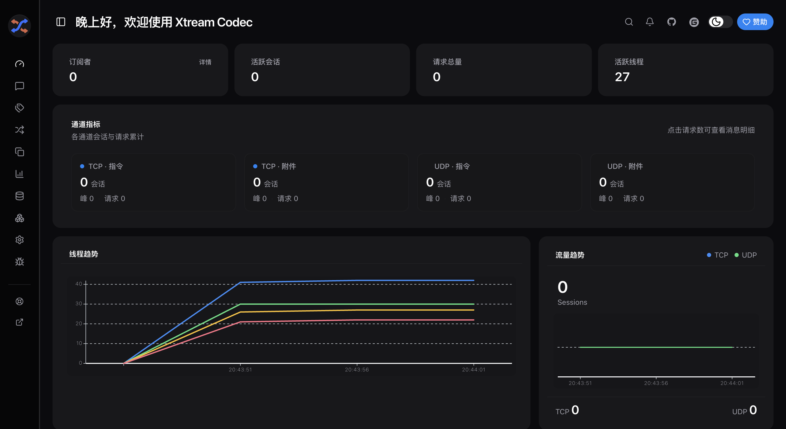
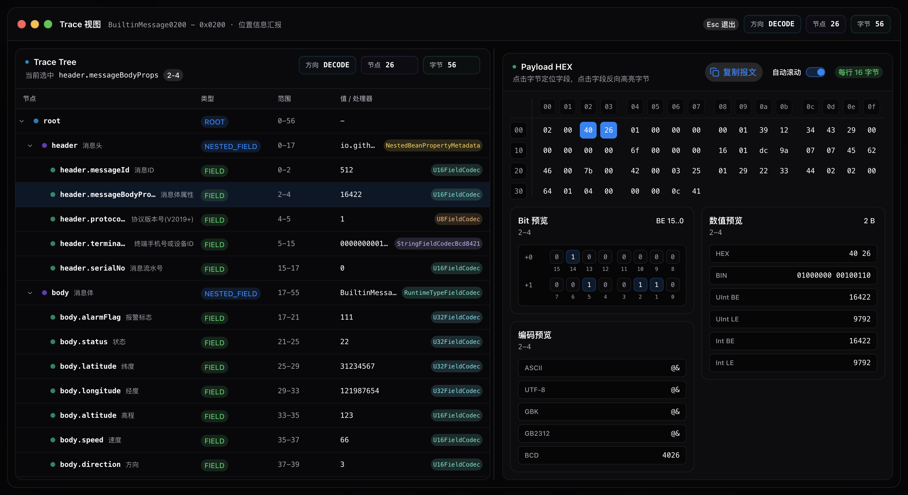

# xtream-codec

<p align="center">
    <a href="https://github.com/hylexus/xtream-codec">
        
    </a>
</p>

<p align="center">
    <a href="https://deepwiki.com/hylexus/xtream-codec">
        
    </a>
    <br/>
    <a href="https://www.apache.org/licenses/LICENSE-2.0">
        
    </a>
    <a href="https://openjdk.org/projects/jdk/21">
        
    </a>
    <a href="https://central.sonatype.com/namespace/io.github.hylexus.xtream">
        
    </a>
    <br/>
    <a href="https://github.com/hylexus/xtream-codec/actions/workflows/gradle-build-linux-platform.yml">
        
    </a>
    <a href="https://github.com/hylexus/xtream-codec/graphs/commit-activity">
        
    </a>
    <br/>
    <a href="https://github.com/hylexus/xtream-codec/graphs/commit-activity">
        
    </a>
    <a href="https://github.com/hylexus/xtream-codec/graphs/commit-activity">
        
    </a>
    <a href="https://github.com/hylexus/xtream-codec/graphs/commit-activity">
        
    </a>
    <a href="https://github.com/hylexus/xtream-codec/graphs/commit-activity">
        
    </a>
</p>

## Tips / 提示

> 2026.1 版的 idea 中打开项目可能会报错

- 临时解决方案: 临时禁用掉 idea 内置的 `Spark` 插件
- 详情参考: [https://youtrack.jetbrains.com/issue/IDEA-386409](https://youtrack.jetbrains.com/issue/IDEA-386409)

> AI 生成的代码都会有标记，比如 `@author opencode (AI)`

## ProjectNaming / 项目命名

项目名来源: `xtream-codec == xtream + codec`

- `xtream == Extensible + Stream`(发音特点合成)
    - `Extensible`: 可扩展
    - `Stream`: <span style="color:red;font-weight:bold;">非阻塞</span>
      的流式编程([projectreactor](https://projectreactor.io))
- `codec == Coder + Decoder`

## Intro / 介绍

该项目是一个基于 [projectreactor](https://projectreactor.io/) 的、和具体协议无关的、异步的、<span style="color:red;">非阻塞的</span>、TCP/UDP 服务端实现。

同时提供了基于 [xtream-codec-server-reactive](xtream-codec-server-reactive) 的 [JT/T 808 协议](ext/jt/jt-808-server-spring-boot-starter-reactive) 和 `JT/T 1078 协议` 的服务端实现：

- JT/T 808 协议
    - 支持多版本(**V2013,V2019**)
    - 支持分包
    - 支持加解密
    - 支持指令下发
    - 支持苏标附件服务
    - 支持链路数据订阅
    - 提供了一个基于 **Spring Boot** 的 **Dashboard**
- JT/T 1078 协议(开发中)
    - quick-start
        - [基于 Webflux](quick-start/jt/jt-1078-server-quick-start-nonblocking/docker/jt-1078-server-quick-start-nonblocking)
        - [基于 Servlet](quick-start/jt/jt-1078-server-quick-start-blocking/docker/jt-1078-server-quick-start-blocking)
    - 参考资料(以下排名不分先后):
        - [https://rtmp.veriskope.com/pdf/video_file_format_spec_v10.pdf](https://rtmp.veriskope.com/pdf/video_file_format_spec_v10.pdf)
        - [Gitee - matrixy/jtt1078-video-server](https://gitee.com/matrixy/jtt1078-video-server)
        - [Gitee - sky/jt1078](https://gitee.com/hui_hui_zhou/open-source-repository)
        - [Gitee - ldming/JT1078](https://gitee.com/ldming/JT1078)
        - [https://www.bilibili.com/video/BV1nG4y1u7HT](https://www.bilibili.com/video/BV1nG4y1u7HT)
        - [https://www.jianshu.com/p/916899d4833b](https://www.jianshu.com/p/916899d4833b)
        - [https://www.jianshu.com/p/07657d85617e](https://www.jianshu.com/p/07657d85617e)
        - [https://www.cnblogs.com/chyingp/p/flv-getting-started.html](https://www.cnblogs.com/chyingp/p/flv-getting-started.html)
        - [https://www.cnblogs.com/CoderTian/p/8278369.html](https://www.cnblogs.com/CoderTian/p/8278369.html)
        - [https://sample-videos.com/index.php#sample-flv-video](https://sample-videos.com/index.php#sample-flv-video)
        - ...

## JT/T 808 QuickStart

```shell
# 支持 amd64 和 arm64 两种架构
docker run -it --rm -p 8888:8888 registry.cn-hangzhou.aliyuncs.com/xtream-codec/jt-808-server-quick-start-with-dashboard:latest
```

启动后访问: [http://localhost:8888/dashboard-ui/](http://localhost:8888/dashboard-ui/)

| 首页                                                                                               | 编解码调试                                                                                     |
|----------------------------------------------------------------------------------------------------|------------------------------------------------------------------------------------------------|
|  |  |

## Roadmap / 版本路线图

通过 [GitHub Milestones](https://github.com/hylexus/xtream-codec/milestones) 管理未来的版本计划

> 欢迎在 Issue 中讨论设计，或认领 `help wanted` 任务参与开发

## Compatibility / 兼容性

参考 : [https://start.spring.io/actuator/info](https://start.spring.io/actuator/info)

> 非 spring 项目可以不用理会这个兼容性
>
> 但依然建议使用 [spring-boot-dependencies](https://central.sonatype.com/artifact/org.springframework.boot/spring-boot-dependencies) 这个 `BOM` 来管理 N 多依赖的兼容性问题

| xtream-version | spring-boot-dependencies | spring-cloud-dependencies |
|----------------|--------------------------|---------------------------|
| **0.1.x**      | **3.5.6 +**              | **2025.0.0**              |
| **0.0.x**      | **3.2.x +**              | **2023.0.3**              |

## Modules / 项目模块

```shell
.
├── build-script  ## 构建脚本
├── docs          ## 文档
├── ext           ## 扩展模块
│     └── jt      ## JT/T 扩展
│         ├── jt-808-server-dashboard-spring-boot-starter-reactive  ## JT/T 808 扩展 - Dashboard - Server
│         ├── jt-808-server-dashboard-ui                            ## JT/T 808 扩展 - Dashboard - UI
│         └── jt-808-server-spring-boot-starter-reactive  ## JT/T 808 扩展
├── quick-start   ## quick-start 示例
│     └── jt      ## JT/T 示例
│         ├── jt-808-attachment-server-quick-start-blocking           ## JT/T 808 附件服务器服务端示例(不带 dashboard)
│         ├── jt-808-attachment-server-quick-start-nonblocking        ## JT/T 808 附件服务器服务端示例(不带 dashboard)
│         ├── jt-808-server-quick-start                               ## JT/T 808 服务端示例(不带 dashboard)
│         ├── jt-808-server-quick-start-with-dashboard                ## JT/T 808 服务端示例(带 dashboard)
│         ├── jt-808-server-quick-start-with-storage-blocking         ## JT/T 808 服务端[阻塞版-SpringMvc]示例(带 存储:clickhouse,mysql,postgres,minio)
│         └── jt-808-server-quick-start-with-storage-nonblocking      ## JT/T 808 服务端[非阻塞版-WebFlux]示例(带 存储:clickhouse,mysql,postgres,minio)
├── debug         ## 调试专用(不用理会)
│     ├── jt      ## JT/T 示例(不用理会)
│     │   └── jt-808-server-spring-boot-starter-reactive-debug   ## JT/T 808 服务端调试(不用理会)
│     ├── xtream-codec-core-debug                       ## xtream-codec-core 模块调试(不用理会)
│     ├── xtream-codec-server-reactive-debug-tcp        ## xtream-codec-server-reactive TCP 调试(不用理会)
│     └── xtream-codec-server-reactive-debug-udp        ## xtream-codec-server-reactive UDP 调试(不用理会)
├── xtream-codec-core                                   ## xtream-codec-core 核心编解码模块
└── xtream-codec-server-reactive                        ## 异步非阻塞的 TCP/UDP 服务端实现
```

## Docs / 文档

- 国内站点: https://iotplanet.top/xtream-codec/
- Github: https://hylexus.github.io/xtream-codec/
- DeepWiki(**AI** 生成): https://deepwiki.com/hylexus/xtream-codec/

## QuickStart / 快速入门

- **Maven** 版示例: [https://github.com/iotplanet/jt-808-quick-start](https://github.com/iotplanet/jt-808-quick-start)
- 带存储的 **JT/T 808** 服务示例
    - 非阻塞版 [jt-808-server-quick-start-with-storage-nonblocking](quick-start/jt/jt-808-server-quick-start-with-storage-nonblocking/README.md)
    - 阻塞版 [jt-808-server-quick-start-with-storage-blocking](quick-start/jt/jt-808-server-quick-start-with-storage-blocking/README.md)
- **自定义** 协议示例
    - 国内站点: https://iotplanet.top/xtream-codec/guide/core/samples/custom-protocol-sample-01/protocol.html
    - Github: https://hylexus.github.io/xtream-codec/guide/core/samples/custom-protocol-sample-01/protocol.html
- **JT/T 808** 协议示例
    - 国内站点:https://iotplanet.top/xtream-codec/guide/core/samples/custom-protocol-sample-02/protocol.html
    - Github: https://hylexus.github.io/xtream-codec/guide/core/samples/custom-protocol-sample-02/protocol.html

## License / 开源协议

`xtream-codec` 使用 [Apache License, Version 2.0](https://www.apache.org/licenses/LICENSE-2.0) 开源许可证。 详情见 [LICENSE](LICENSE) 文件。

第三方依赖的许可证信息:

- 请参考生成的 **.jar** 文件中的 `META-INF/NOTICE.txt` 文件 。
- 或者, 执行 `./gradlew clean generateLicenseReport` 之后查看生成的 `build/reports/dependency-license/THIRD-PARTY-NOTICES.txt` 文件。

## Funding / 打赏

项目的发展离不开你的支持，请作者喝一杯🍺吧！


## References / 参考资料 / 致谢

- [https://github.com/anomalyco/opencode](https://github.com/anomalyco/opencode)
- [https://github.com/forrestchang/andrej-karpathy-skills](https://github.com/forrestchang/andrej-karpathy-skills)
- [https://github.com/Fission-AI/OpenSpec](https://github.com/Fission-AI/OpenSpec)
- [https://github.com/code-yeongyu/oh-my-openagent](https://github.com/code-yeongyu/oh-my-openagent)

## TODO / 待办

- [JT/T 1078 扩展](ext/jt/jt-1078-server-spring-boot-starter-reactive)
    - [ ] 代码简化(80%)
    - [ ] 码流断开时未消费的数据未释放的问题
    - 协议
        - [x] TCP
        - [x] UDP
            - 没有实现一个 UDP 包中包含多个 RTP 包的场景
            - 没有实现 UDP 包乱序的处理
    - [ ] 音频
        - [x] ADPCMA（以下参考资料排名不分先后）
            - [https://wiki.multimedia.cx/index.php/IMA_ADPCM](https://wiki.multimedia.cx/index.php/IMA_ADPCM)
            - [https://www.hentai.org.cn/article?id=8](https://www.hentai.org.cn/article?id=8)
            - [https://github.com/pdeljanov/Symphonia.git](https://github.com/pdeljanov/Symphonia.git)
            - [https://www.cs.columbia.edu/~hgs/audio/dvi/IMA_ADPCM.pdf](https://www.cs.columbia.edu/~hgs/audio/dvi/IMA_ADPCM.pdf)
            - [https://ww1.microchip.com/downloads/en/AppNotes/00643b.pdf](https://ww1.microchip.com/downloads/en/AppNotes/00643b.pdf)
        - [x] G711
            - 翻译自 [mazcpnt/maz-g711](https://gitee.com/mazcpnt/maz-g711/blob/master/maz_cpnt_g711.c)
        - [ ] G726
        - [x] AAC
            - 感谢 [@sky](https://gitee.com/hui_hui_zhou/open-source-repository)
    - [ ] 视频
        - [x] H.264（以下参考资料排名不分先后）
            - [https://rtmp.veriskope.com/pdf/video_file_format_spec_v10.pdf](https://rtmp.veriskope.com/pdf/video_file_format_spec_v10.pdf)
            - [https://gitee.com/ldming/JT1078](https://gitee.com/ldming/JT1078)
            - [https://gitee.com/matrixy/jtt1078-video-server](https://gitee.com/matrixy/jtt1078-video-server)
            - [https://gitee.com/hui_hui_zhou/open-source-repository](https://gitee.com/hui_hui_zhou/open-source-repository)
            - [https://www.cnblogs.com/CoderTian/p/8278369.html](https://www.cnblogs.com/CoderTian/p/8278369.html)
            - [https://sample-videos.com/index.php#sample-flv-video](https://sample-videos.com/index.php#sample-flv-video)
            - [https://www.jianshu.com/p/916899d4833b](https://www.jianshu.com/p/916899d4833b)
            - [https://www.jianshu.com/p/07657d85617e](https://www.jianshu.com/p/07657d85617e)
            - [https://www.cnblogs.com/chyingp/p/flv-getting-started.html](https://www.cnblogs.com/chyingp/p/flv-getting-started.html)
        - [ ] H.265
    - SIM
        - [x] `BCD[6]`
        - [x] `BCD[10]`
            - 感谢 [@sky](https://gitee.com/hui_hui_zhou/open-source-repository)
    - [ ] [jt-1078-server-dashboard-ui](ext/jt/jt-1078-server-dashboard-ui) 开发
- [JT/T 808 扩展](ext/jt/jt-808-server-spring-boot-starter-reactive)
    - [ ] 术语重命名为 `Jt808` 标准中出现的单词
    - [ ] [jt-808-server-dashboard-ui](ext/jt/jt-808-server-dashboard-ui) 完善
- [xtream-codec-core](xtream-codec-core)
    - [ ] 注解增强
- [xtream-codec-server-reactive](xtream-codec-server-reactive)
    - [ ] 简化初始化代码
